# Массивы и строки

## Одномерные массивы
**Массив** - упорядоченная совокупность однотипных элементов, имеющих общее имя
Такое имя называется **полной переменной**
Тип элементов - **базовый тип массива**
Обращение к элементам массивов происходит по **индексам**

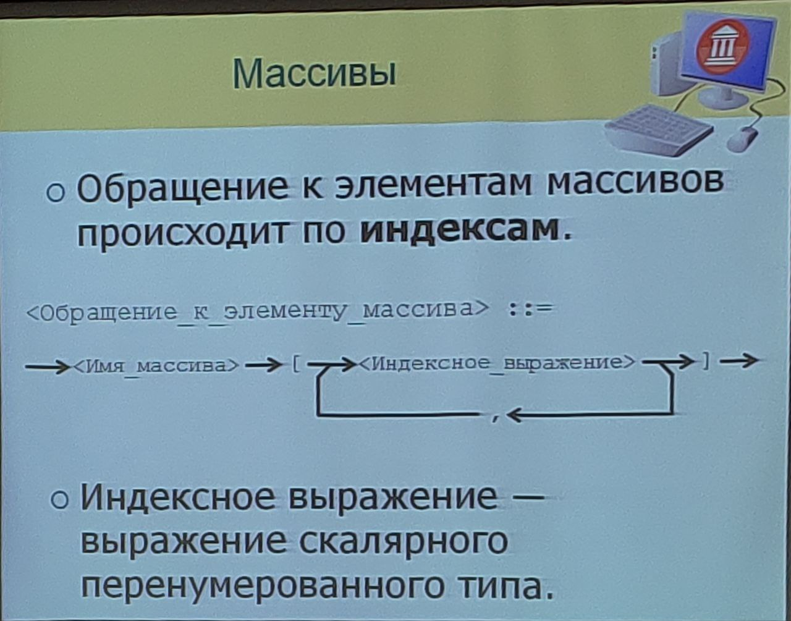

Как задаётся тип массива:
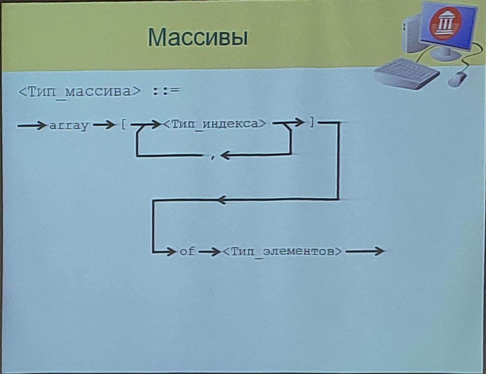
Тип индекса:
 - Любой перенумерованный тип;
 - Количество элементов массива определяется количеством возможных значений этого типа.

Полученный массив не должен быть слишком большим

Пример объявления типов массивов с разными типами индексов:
```Pascal
type:
  TMyArray = array [1..10] of Integer;   // [1..10] - 10 элементов
  TSomeArray = array [Boolean] of Byte;  // [Boolean] - 2 элемента
  TOtherArray = array [Char] of Word;    // [Char] - 256 элементов
  TMyType = array ['a'..'z'] of Real;    // ['a'..'z'] - 26 значений
  TBadType = array [Integer] of Int64;   // [Integer] - 4+млрд элементов (это пиздец)
```

**Best practice:** Задача конечного значения интервала через константу
```Pascal
const
  N = 1000;
type
  TMyArray = array [1..N] of 18..70;
  TMyType = array [Byte] of (X, Y, Z);  // (X, Y, Z) - перечислимый тип
```

В качестве индекса может указываться любое выражение, имеющее тот же тип, что и индекс

**_Как по индексу найти элемент с этим индексом?_**
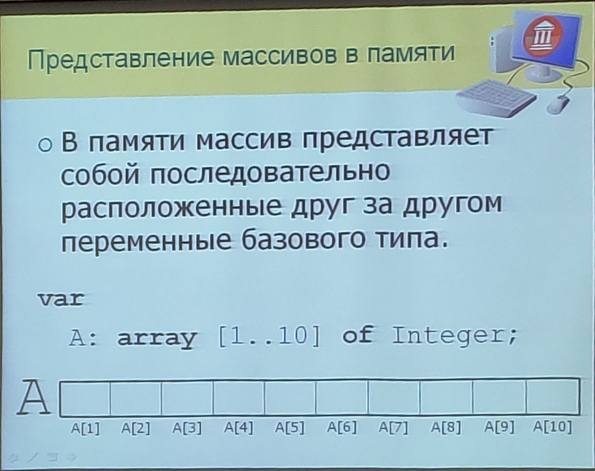

Выход за границы массива - **ФАТАЛЬНАЯ ОШИБКА**. При выходе за границы массива **память не заканчивается**. При сборке проекта у компилятора может не быть Check RangeError, и мы можем прочитать/перезаписать значение, находящееся за нашим массивом. Помоги вам Господь, если это произойдёт
- Может приводить к повреждению данных;
- В некоторых языках (C/C++) приводит к неопределённому поведению;
- Часто такая ошибка долго не проявляется и обнаруживается при внесении значительных изменений в программу.

```Pascal
// Пример ошибки
test := 1;
for i := 1 to n+1 do
begin
  mas[i] := i;
  Write(mas[i], ' ');  // 1 2 3 4 5 6
end;

for i := 1 to n do
begin
  Write(mas[i], ' ');  // 1 2 3 4 5
end;

writeln(test);         // 6
```

Элементами массива могут быть массивы
Две формы записи:
- Сокращённая;
- Полная.
  
```Pascal
const
  N = 10;
  M = 20;
type
  TArray = array [1..N, 1..M] of Byte;            // Сокращённая форма
  TArray = array [1..N] of array [1..M] of Byte;  // Полная форма

  TRow = array [1..M] of Byte;                    // Тип через тип
  TMatrix = array [1..N] of TRow;
```
## Многомерные массивы

### Обращение к многомерному массиву:
```Pascal
A[i, j, k]
A[i][j][k]
```
- Типы индексов могут быть различными
- Размерность массива языком на ограничивается, теоретически. Ограничения могут накладывать:
- - Адресное пространство (привет нехватка физической памяти);
- - Конкретная реализация компилятора;
- - И т.д.

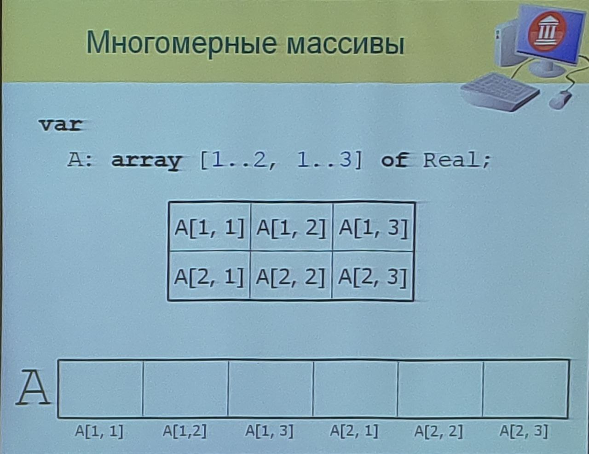
- Над элементами массивов определены те же операции, что и над их базовыми типами;
- **Индексированная переменная** - элемент массива (```arr[i]```)
- - Ведёт себя, как обычная переменная базового типа.
- **Полная переменная** - сам массив целиком.

### Операции над массивами:
- Над полными перемнными не определенно никаких операций;
- Полные переменные могут использоваться в операторе присваивания.
- - Массивы должны быть одного и того же типа(!);
- - При этом выполняется копирование всех значений всех элементов;
- - Можно использовать и для подмассивов.
```Pascal
// Пример копирования массивов
var
  A, B: array [1.10000000] of Integer;
begin
  // Плохой вариант. В данной ситуации мы поштучно перетаскиваем каждый элемент
  for I := 1 to 10000000 do
    A[I] := B[I];
  
  // Хороший вариант. А тут компилятор перекидывает большими кусками, уменьшая кол-во итераций
  A := B;
end.
```

## Типизированные константы-массивы
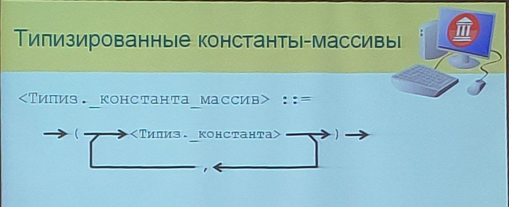
```Pascal
// Пример
type
  TArray = array [1..5] of Byte;
const
  A: TArray = (12, 6, 73, 8, 2);
```

```Pascal
// Пример трёхмерного массива
type
  TMatrix = array [1..2, 1..2, 1..2] of Real;
const
  M: TMatrix = (
    (
      (0, 1), (2, 3)
    ),
    (
      (4, 5), (6, 7)
    )
  );
```
```Pascal
// Пример шахматной доски
type
  TCellState = (csEmpty, csWhite, csBlask);
  TDesk = array[1..8, 1..8] of TCellState;
const
  StartState: TDesk = (
    (csEmpty, csBlack, csEmpty, csBlack, ...),
    (csBlack, csEmpty, csBlack, csEmpty, ...),
    ...
  );
var
  GameDesk: TDesk;
begin
  GameDesk := StartState;
end.
```
**Инициализация** - задание начального значения переменной
**Инициализация массива** - задание начальных значений всем его элементам
```Pascal
var
  i: Integer;
  MyArray: array [1..10] of Integer;
begin
  for i := 1 to 10 do
    MyArray[i] := i;
end.
```

## Строки
### Строки и литералы
**Строка** - последовательность символов
Строковые данные:
- Константы;
- Переменные.
  
**Строковый литерал** - последовательность символов, заключённая в апострофы.
- Если в строке должен быть символ апострофа:
- - Он удваиваится;
- При подсчёте длины строки учитыаются пробелы (очевидно).

Строковый литерал - ```'Some silly piece of text'```
Строковый литерал с апострофом - ```'Don''t worry, be happy!'```
Ситуация с апострофом в си-подобных языках - ```"Премьера спектакля \"Чёрный замок\""```
Пустая строка - ```''```
Символ с определённым кодом можно вставить так - ```'First line'#13#10'Second line'``` (через # на стыке строковых литералов)

### Строковые переменные
2 вида строковых переменных:
- Строки постоянной длины;
- Строки переменной длины.

#### Строка постоянной длины
```Pascal
array [1..N] of Char
```
Такая строка обладает всеми свойствами массива
- Можно присвоить значение другой строковой переменной той же длины;
- Можно обращаться к отдельным символам по индексам.

В отличе от массивов:
- Можно присваивать строковые литерали, если их ддлина равна количеству элементов в массиве;
- Можно сравнивать строки одинаковой длины:
- - Сравнение производится посимвольно слева направо;
- - Больше та строка, у которой первый несовпадающий символ имеет больший код.

#### Строки переменной длины
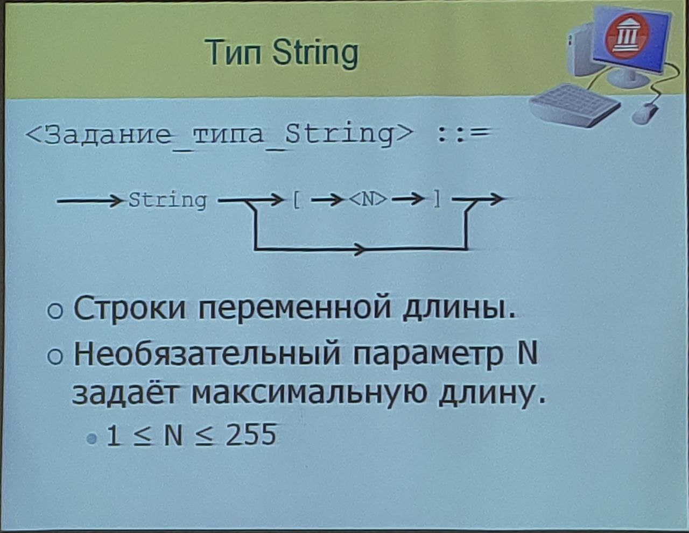
По умолчанию (если не задана) максимальная длина систавляет 255 символов
- То есть ```String``` эквивалентно ```String[255]```;
- Справедливо для классического Pascal;
- В Delphi всё несколько иначе...

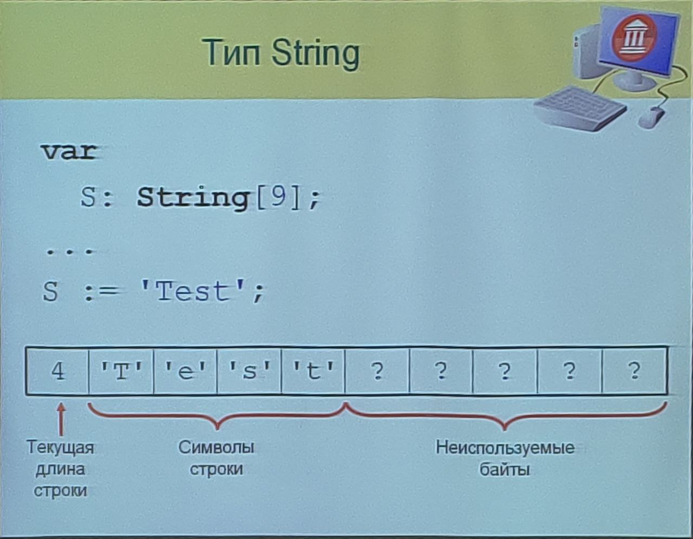
Доступ к символам строки осуществляется по индексам
- Нумерация начинается с 1;
- Обращение к символу с индексом не из диапазона 1..N аналогично выходу за границы массива.

**Строковые выражения** - выражение, результатом вычисления которого является значение строкового типа

#### Операции над типом ```String```
- Операции конкатенации;
- Операции сравнения.
  
```Pascal
var
  S1, S2: String;
begin
  ...
  // Конкатенация
  S1 := 'Result: ' + S2;
  ...
  // Сравнение
  'AB' > 'A'        // true
  'Полка' > 'Пол'   // true
end.
```

#### Встроенные функции для типа ```String```
```Copy(S, From, Count)```
- Создаёт строку копированием ```Count``` символов начиная с позиции ```From``` из строки ```S```.

```Concat(S1, S2, ..., Sn)```
- Создаёт строку конкатенацией строк, переданных в качестве параметров;
- Давала лучший результат, чем складывание через оператор ```+```, сейчас не принципиально.

```Length(S)```
- Возвращает длину строки S в символах.

```Pos(Substr, S)```
- Возвращает позицию первого вхождеия подстроки ```Substr``` в строку ```S```.
  
```Delete(S, From, Count)```
- Удаляет из ```Count``` символов начиная с позиции ```From``` из строки ```S```
  
```Insert(Substr, S, From)```
- Вставляет строку ```Substr``` в строку ```S``` начиная с позиции ```From```

```Str(Value, S)```
- Помещает в ```S``` строковое представление числа ```Value```
  
```Val(S, Value, ErrorCode)```
- Помещает в переменную ```Value``` числовое представление строки ```S```. В ```ErrorCode``` помещается индекс первого недопустимого символа (0 при успешном преобразовании)
  
### Способы представления строковых данных
Существуют различные способы
представления строк в памяти.
Для описания строки необходимо
указать:
- положение в памяти начала строки;
- ...

#### Основные способы представления строковых данных:
- Pascal-строки
- - Length-prefixed strings
- - P-strings
- C-строки
- - Null-terminated strings
- - ASCIIZ strings
  

#### Pascal-строки

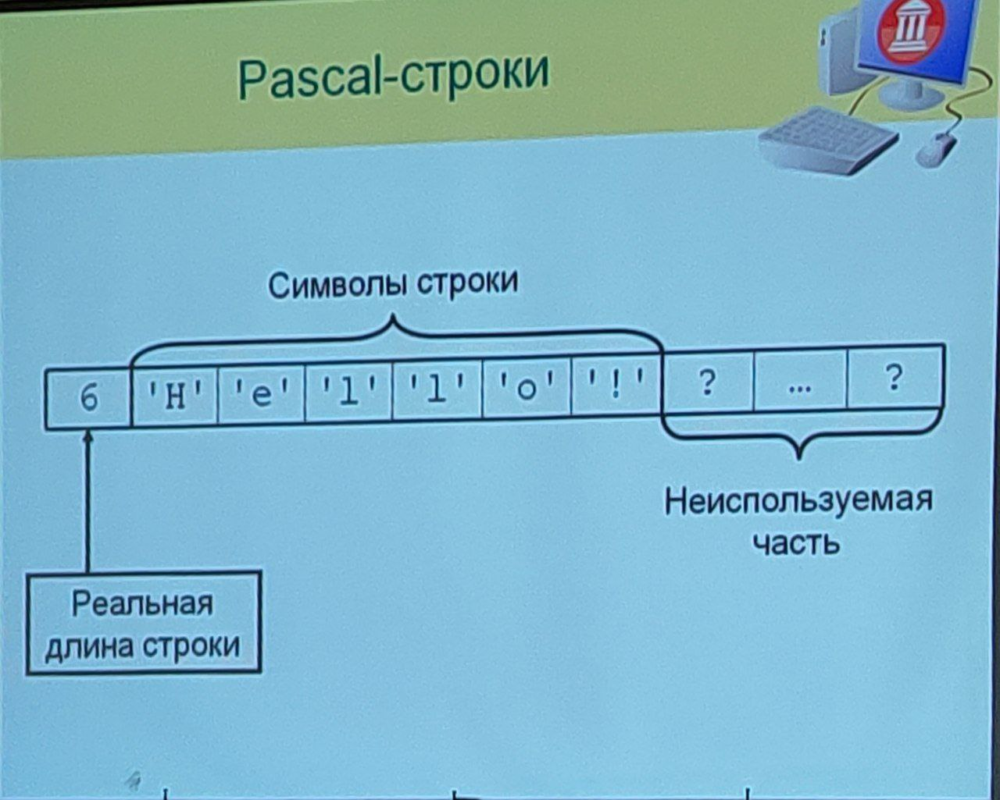

#### Си-строки
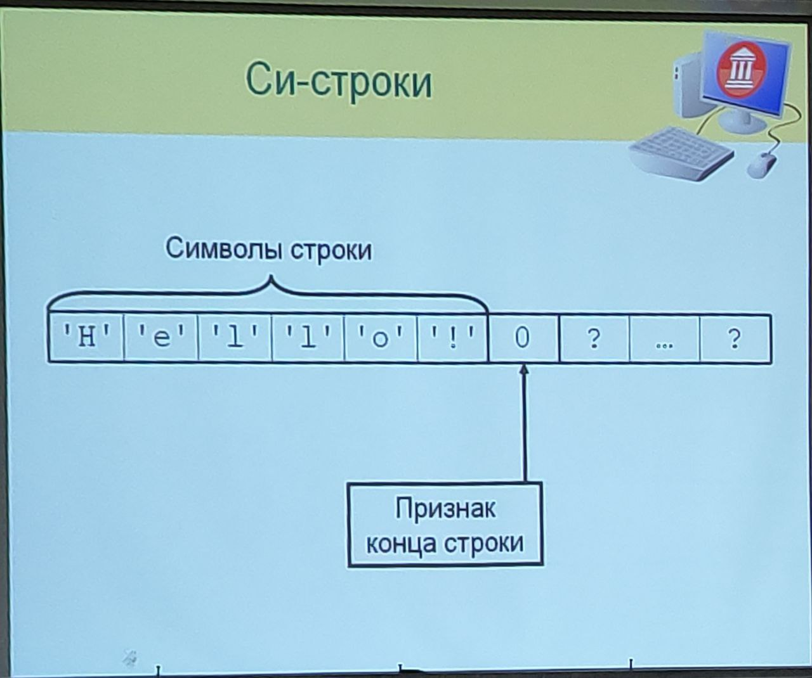

#### Delphi-строкі

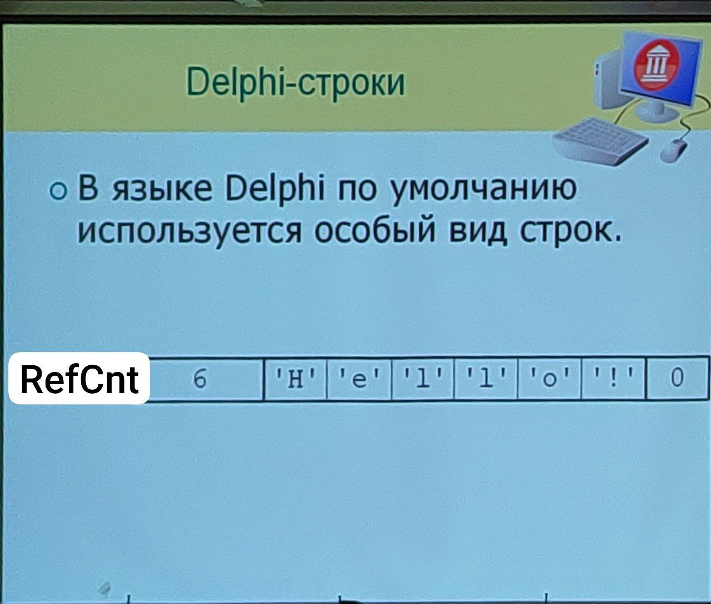
- RefCnt - Подсчёт ссылок широко используется для решения задачи автоматического управления памятью;
- Значения счётчика ссылок (RefCnt) - кол-во переменных, ссыляющихся на объект (строку/массив)
- - Когда счётчик ссылок становится равынм 0, память, занятая объектом, освобождается;
- Тип String может соответствовать различным видам строк:
- - ```String[N]```- всегда Pascal-строки;
- - ```String``` - Pascal- или Delphi-строки, в зависимости от настроек компилятора;
- Переменная типа Delphi-строка на самом деле является указателем
- - Присваивание **nil** позволяет удалить ссылку на строку;
- - Значение **nil** эквивалентно пустой строке;
- У строковых констант счётчик ссылок равен -1 и никогда не измменяется;
- На самом деле скрытых полей (байтов) ещё больше. Подробнее в справочнике по Delphi (Почитать до экзамена, иначе бо-бо);
- При попытке изменения строки:
- - Если счётчик ссылок = 1, изменение происходит "по месту";
- - Иначе создаётся копия строки и в дальнейшем работа ведётся с этой копией. При этом счётчик ссылок уменьшается на 1 (кроме случая, когда он равен -1).

**Delphi-строки** - управляемый тип данных
- Инициализируется компилятором в значении nil (в том числе локальные переменные);
-  Управление занятой памятью и размерами осуществляется компилятором.
  
Преимущества Delphi-строк
- Быстрое выполнение операций над строками. Не нужно каждый раз определять длины строк;
- Совместимость с Си-строками. Позволяет передавать Delphi-строки операционной система, не выполняя дополнительных преобразований;
- Экономия памяти. При присваивании строк не выполняется их копирование (в памяти остаётся один экземпляр).
  
## Динамические массивы

**Динамические массивы** - массивы, размер которых может изменяться во время выполнения программы.

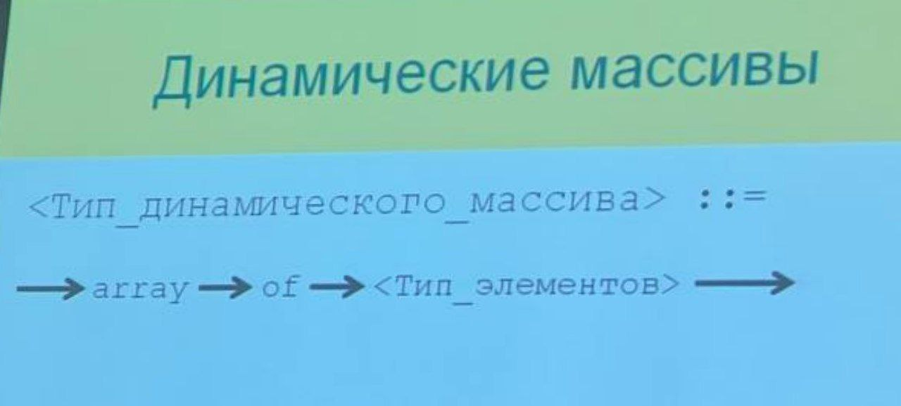

Динамические массивы устроены так же, как Delphi-строки:
- Перед началом данных хранятся:
- - Текущее количество элементов;
- - Счётчик ссылок;
- Значение перемнной такого типа - указатель;
- Значение **nil** эквивалентно пустому динамическому массиву. Присвоив значение **nil** удаляем ссылку на динамический массив

Отличия:
- В строках был нулевой элемент, для совместимости с Си-строками. Тут этого элемента нет;
- Динамические массивы могут быть многомерными;
- Динамические массивы могут занимать много памяти, если много больших элементов

```SetLength(Arr, NewLength)```
- Устанавливает размер динамического массива ```Arr``` в ```NewLength``` элементов;
- Если новый размер меньше старого, обрезаются последние элементы.

```Length(Arr)```
- Возвращает текущее количество элементов в динамическом массиве.
- **ВАЖНО!** Индекс последнего элемента динамического массива на 1 меньше, чем длина массива.

Подводные камни при копировании динамических массивов:
```Pascal
var
  A, B: array of Integer;
begin
  ...            // Заполнение A
  B := A;
  B[5] := 5;     // A[5] тоже равно 5, копия НЕ создаётся

  B := Copy(A);  // А вот тут создаётся копия массива
eng.
```
Установка длины для многомерного динамического массива:
```Pascal
var
  Arr: array of array of TMyType;
begin
  ...
  SetLength(Arr, 5, 10);
end.
```