# Структурное программирование

## GoTo - использовать нельзя игнорировать

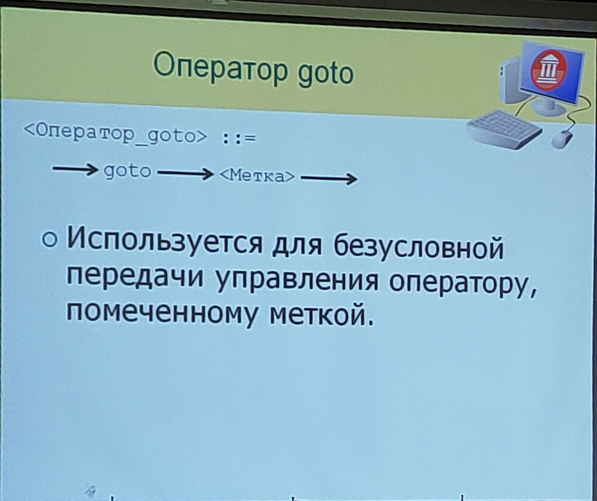

Пример использования:
```Pascal
  label 1, 2;

...

  I := 1;
1:
  if I > 10 then
    goto 2;
  WriteLn(I:7);
  Inc(I);
  goto 1;
2:
  WriteLn('Mission complete.');
```

Ограничения
- Нельзя переходить внутрь производных операторов, не содержащих данный оператор goto:
- - составной оператор, for, while, repeat...until, if, case, with и так далее;
- Нельзя переходить из одной альтернативы в другую в выбирающих операторах (if, case);
- Нельзя входить в подпрограмму или выходить из неё.

Пример спагетти (запутанного) кода на Basic:
```Basic
10 I = 0
20 I = I + 1
30 IF I <= 10 THEN GOTO 70
40 IF I > 10 THEN GOTO 50
50 PRINT "Программа завершена."
60 END
70 PRINT I; " квадрат = "; I * I
80 GOTO 20
```

В рамках парадигмы структурного программирования использование оператора ```goto``` считается нежелательным

Структурное программирование - это...
- Подход к разработке программ;
- Возник в 1970-х годах с появлением ЭВМ 3-его поколения
- В основу положено требование
- - Каждый модуль (участок) программы должен проектироваться с единственным входом и единственным выходом
- При этом программа состоит из вложенных модулей, удовлетворяющих этому требованию

## Преобразования Бома-Джакопини
**Принцип Бома-Джакопини** - любая программа может быть разработана с использованием **трёх базовых структур:**
- Функционального блока;
- Конструкции принятия двоичного (дихотомического) решения;
- Конструкции обобщённого цикла.

Функциональный блок:
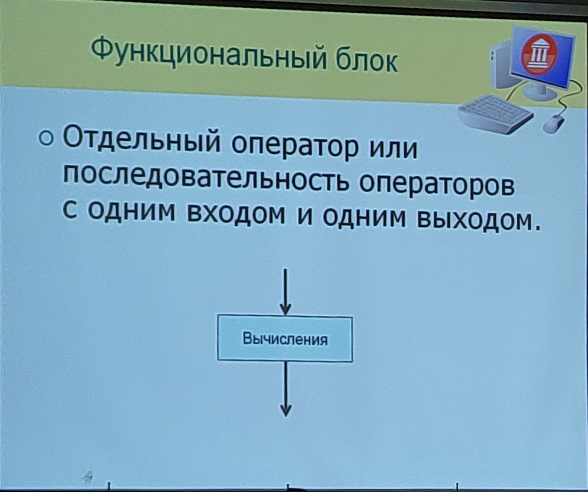

Конструкции принятия двоичного решения
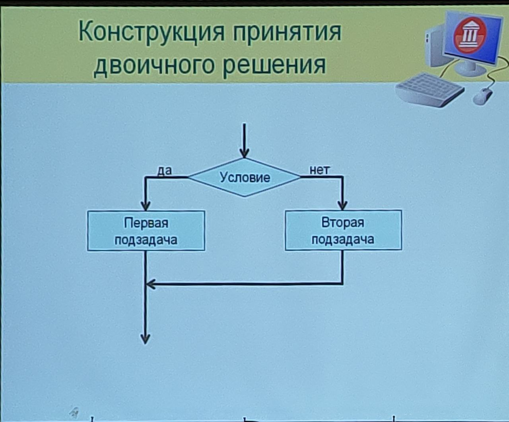

Конструкции обобщённого цикла
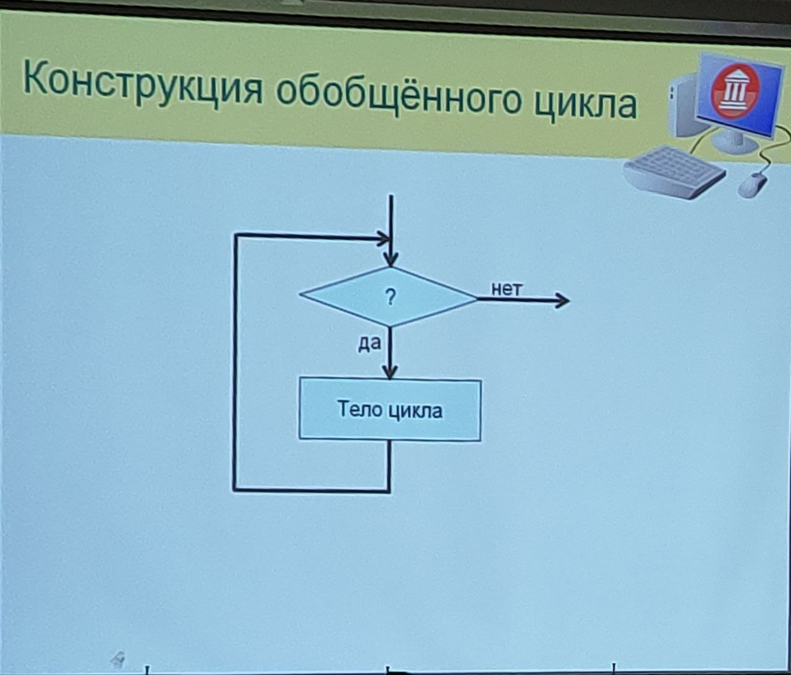

### Основные концепции:
- Отказ от использования оператора безусловного перехода goto;
- Применения фиксированного набора управляющих конструкций (3 базовых конструкции);
- Использование метода нисходящего проектирования.

### Достоинства:
- Упрощение тестирпования программ;
- Повышение производительности программистов;
- Повышение читаемости программ - упрощается их сопровождение;
- Повышение эффективности объектного кода программ.

### Три главных преобразования:

1. 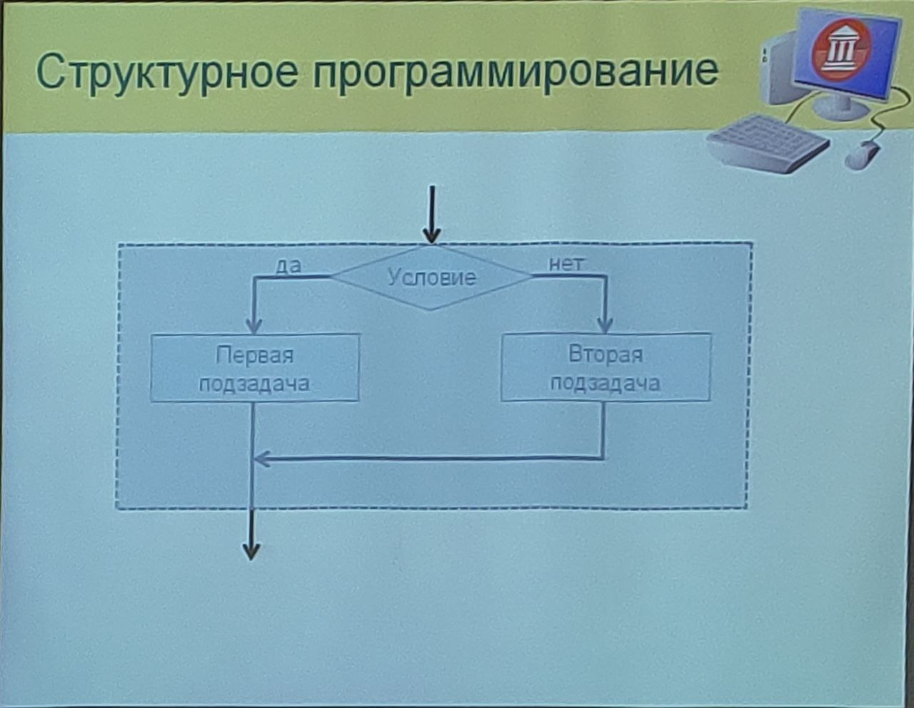
2. 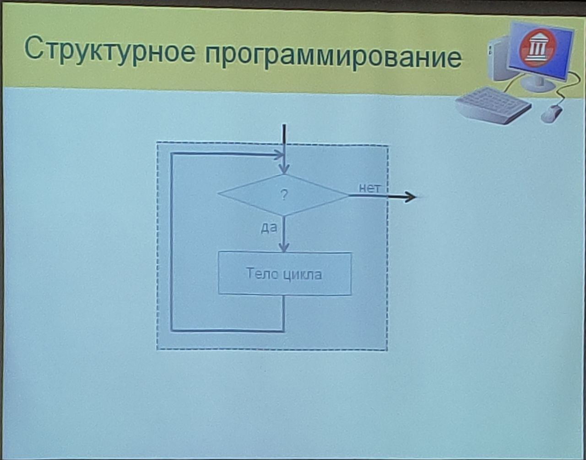
3. 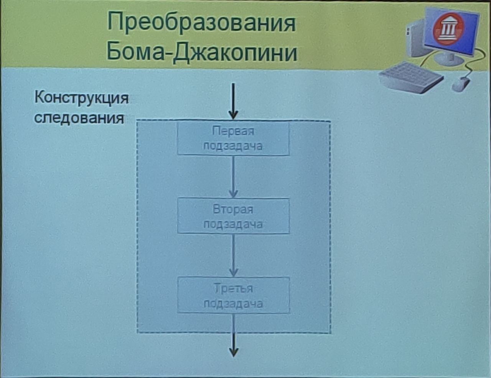


### Ещё раз про принципы
- Принципы используются для доказательства:
- - Правильности программы;
- - Структурированности программы.
- Основаны на принципе "Чёрного ящика";
- Обратные преобразования могут использоваться для проектирования по методу нисходящего проектирования;
- Все операции в программе должны представлять собой:
- - Исполняемые в линейном порядке выражения;
- - Вызовы подпрограмм (обращение к замкнутому участку кода с 1 входом и 1 выходом);
- - Вложенные на произвольную глубину операторы if-then-else;
- - Циклические операторы (while).
- Иногда допускаются **расширения**:
- - Дополнительные конструкции цикла:
- - - Цикл с параметром;
- - - Цикл с постусловием;
- - Подпрограммы с несколькими входами или выходами*;
- - Оператор **goto** с жёсткими ограничениями*;
- - Оператор **case** как расширение **if**.
  
## Оператор ```case```

Описание синтаксиса
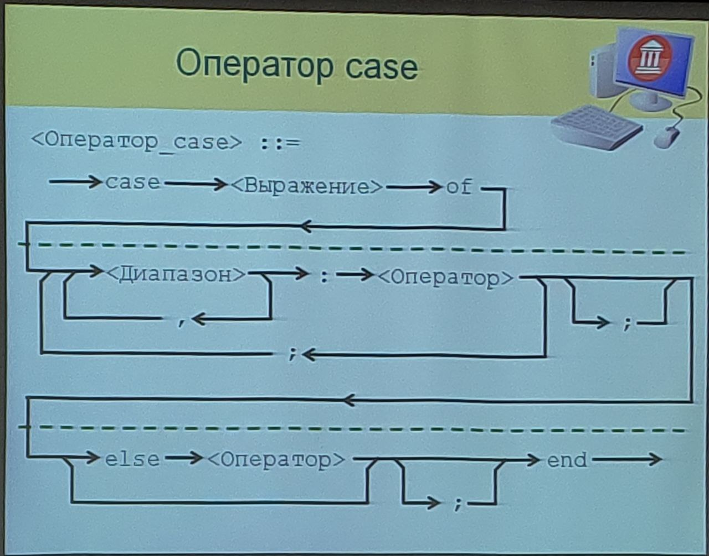

Реализация:
```pascal
case Symbol of
  'A'..'Z', 'a'..'z':
    WriteLn('Letter');
  '0'..'9':
    WriteLn('Digit');
  else
    WriteLn('Other character');
end
```

- Выполняется только одна ветвь - та, которая соответсвтует значению селекта (выражения);
- - Выражение-селектор должно быть перенумерованного типа;
- Если подходящей ветви нет, выполняется ветвь ```else```;
- - Если нет и её, не выполняется ни одна из ветвей.

Схема алгоритма:
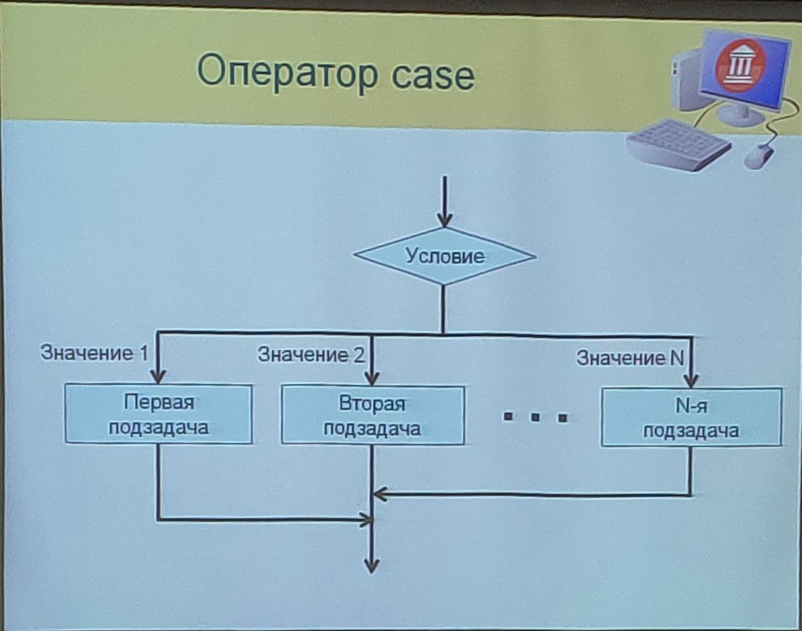

## Операторы ```break``` и ```continue```
Схема описания
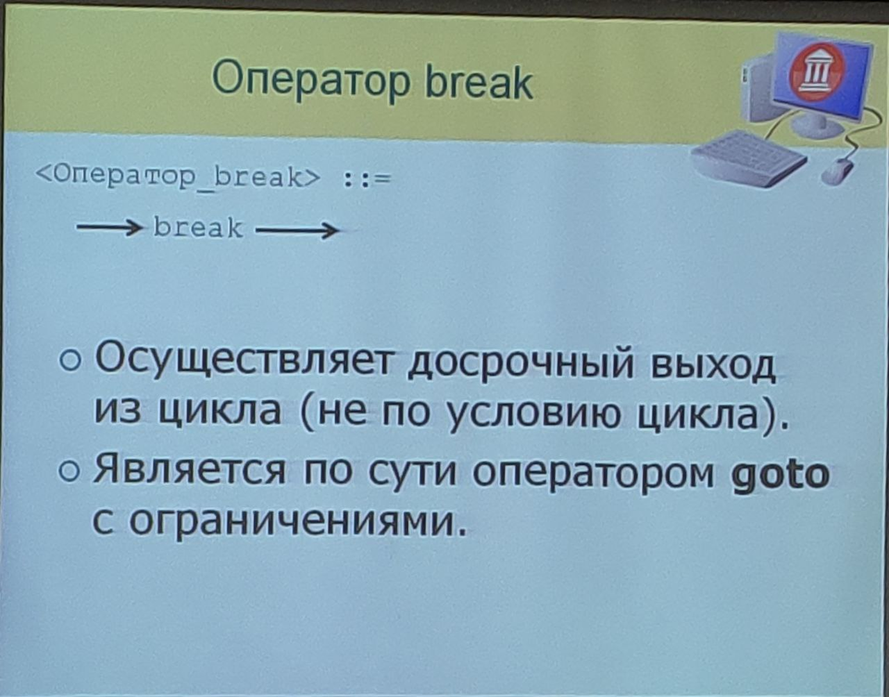

Реализация
```pascal
for I := 1 to 1000 do
begin
  <Операторы>
  if X > 0 then
    break;
  <Операторы>
end;
<Прилетит сюда>
```
```pascal
while True do
  <Операторы>
  if <Условие_1> then break;
  <Операторы>
  if <Условие_2> then break;
  <Операторы>
  if <Условие_3> then break;
  <Операторы>
end;
```

Описание синтаксиса
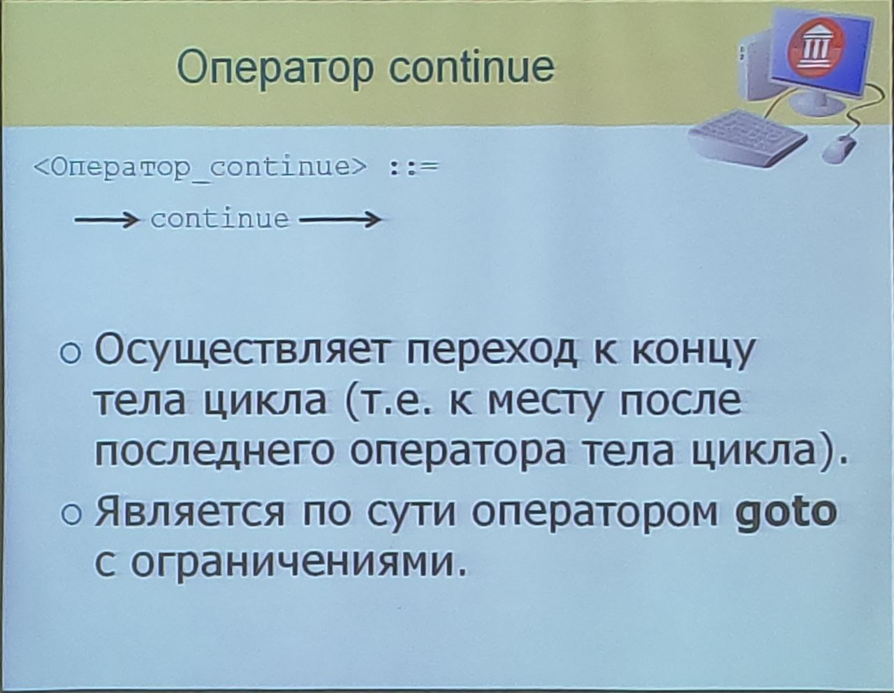

Реализация
```pascal
for I := 1 to 1000 do
begin
  <Операторы>
  if X > 0 then
    continue;
  <Операторы>
  <Прилетит сюда> 
end;
```

- Операторы ```break``` и ```continue``` нарушают принципы структурного программирования:
- - ```break``` позволяет создать цикл с несколькими выходами;
- - ```continue``` позволяет создать конструкции с несколькими выходами внутри тела цикла;
- Тем не менее, их использование **иногда** допускается

## Снова ```goto```

- Применения оператора ```goto``` также иногда может быть оправдано:
- - Выход из нескольких вложенных циклов;
- - Сложная обработка ошибок;
- - Автоматически сгенерированный код.

```pascal
// Пример выхода из вложенного цикла
  while A > B do
  begin
    for I := 1 to N do
      for J := 1 to M do
        if Matrix[I, J] = Value + A then
        begin
          WriteLn(I, J);
          goto ExitLabel;
        end;
    A := A - 1;
  end;
ExitLabel;
```
```pascal
// Пример обработки ошибок
  <Операторы>
  if <Условие_ошибки_1> then goto Error1;
  <Операторы>
  if <Условие_ошибки_2> then
  begin
    <Операторы>
    goto Error2;
  end;
  <Операторы>
  goto Error0;
Error2: // Обработка ошибки 2
Error1: // Обработка ошибки 1
Error0: // Если ошибок не было
```